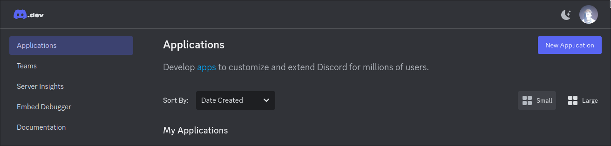
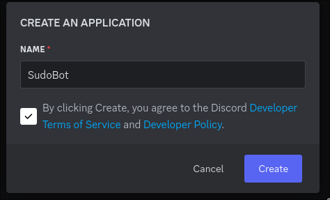
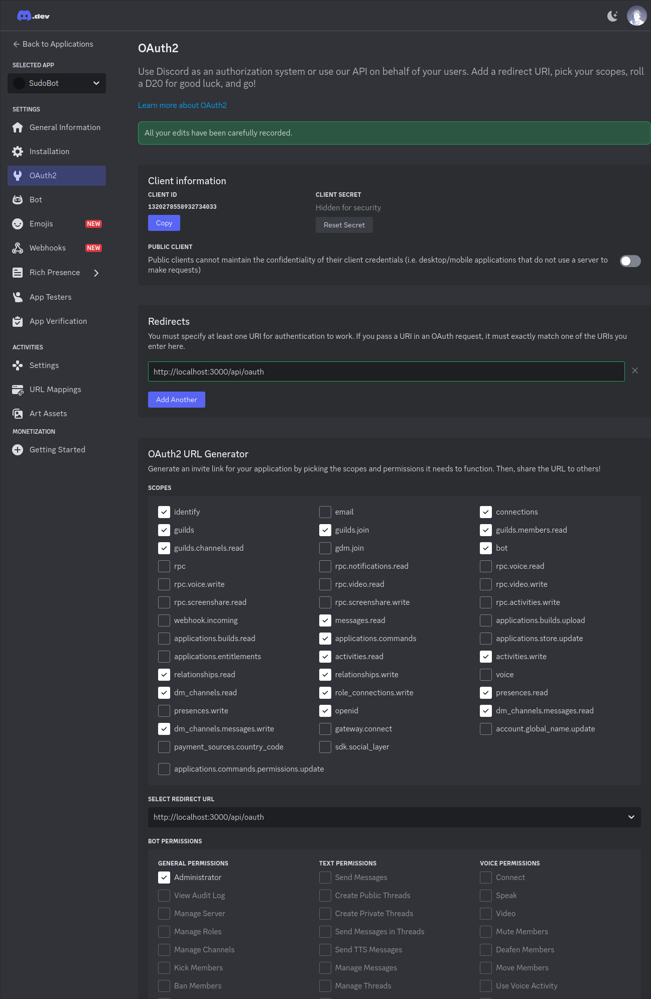
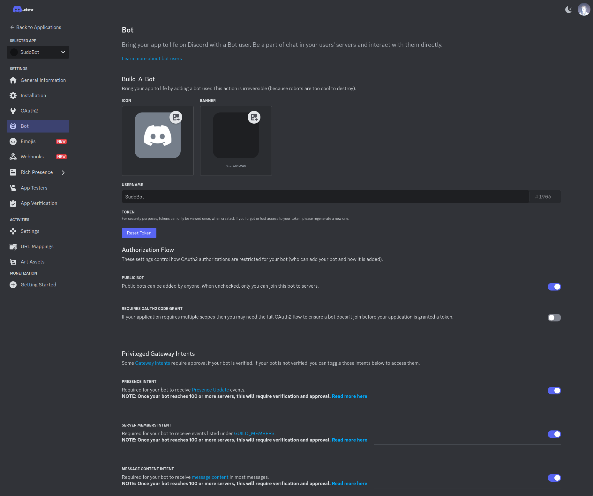

# SudoBot v2

This is a Discord bot that manages communities. It was written for the [sudo.gay](https://sudo.gay/) Discord community.

## Installation (for production)

### Installation pre-requisites

Production and local development require Docker Engine to be installed.

You must be an owner/administrator of at least one server for this to be useful.

### Create a Discord application and Bot

- Go to the [Discord Developer portal](https://discord.com/developers/applications)
- Click the *New Application* button at the top right
    
- Give the application a name
    
- Click the OAuth menu item and configure the a redirect URI. Don't forget to save the page!
    - For development http://localhost:3000/api/oauth
    - For production https://YOURSERVER/api/oauth
    
- Click the *Reset Secret* button and copy the new secret that you are given. This will become DISCORD_CLIENT_SECRET in your environment file
- Copy the Client ID - this will become DISCORD_CLIENT_ID in your environment file.
- Click the Bot menu item, and configure the bot settings (you will need to enable several Intents as noted below)
    
- Click the *Reset Token* button and copy the new token that you receive. This will become your DISCORD_BOT_TOKEN environment variable.

### Installation

- Create an .env file using the .env-prod-example as a template
- Enter your values for DISCORD_CLIENT_ID, DISCORD_CLIENT_SECRET and DISCORD_BOT_TOKEN from the above procedure.
- Start sudobot using docker compose

```
cp .env-prod-example .env
# Edit the .env file as required
docker compose pull
docker compose up -d
```

### Login and set up your bot to be useful

- Open the Bot web interface and login with your Discord.
- You will get a server list of your servers. On first use you will want to invite the bot to one of your servers.
- Further help, examples and tutorials are covered in the docs/ directory.

## Development

The project is under the MIT open source license. We would welcome contributions and feedback from the community.

Please read the CONTRIBUTING.md file for more information on contributor guidelines. The rest of this
section will be to stand up your own development environment.

First step - follow the instructions above to create your own Discord application and bot. 

Copy the .env-dev-example file to .env and edit your new .env file. You will need to define your DISCORD_CLIENT_ID, DISCORD_CLIENT_SECRET and DISCORD_BOT_TOKEN variables at a minimum.

The start development, simply run these commands. They will build the docker image and stand up a development
environment for you to view on http://localhost:3000

```
docker compose -f docker-compose-dev.yml build
docker compose -f docker-compose-dev.yml up -d
docker compose -f docker-compose-dev.yml logs -f
```
